# CivGraph

An agent-based model of urban social dynamics, built on Pierre Bourdieu's theory of capital and habitus, deepened by Actor-Network Theory (Latour, Callon, Law). 3,000 individuals (configurable up to 10,000) in a mid-scale city form a heterogeneous network where influence, opinion, and power flow through clan ties, professional bonds, institutional memberships, and shared dispositions -- shaped by macro forces of economy, housing, migration, culture, and governance, disrupted by waves of technological change (modeled as non-human actants), refracted through print, mass, and social media, grounded in the social determinants of health, and analyzed through the lens of translation sociology, performativity, and obligatory passage points.


## Quick Start

**Python:**
```bash
pip install -r requirements.txt
python run.py
# http://localhost:8420
```

**Docker:**
```bash
docker build -t civgraph .
docker run -p 8420:8420 civgraph
# http://localhost:8420
```

**Standalone binary** (no Python required):
```
# Windows: download civgraph.exe from Releases
civgraph.exe
# Opens browser automatically
```

---

## Theoretical Foundations

CivGraph operationalizes concepts from Bourdieu's *Distinction* (1979), Latour's *Reassembling the Social* (2005), Callon's translation sociology (1986), Law's heterogeneous engineering (1987), Autor's task-content framework (2003), Marmot's social determinants of health (2005), Mizruchi's interlocking directorates (1996), Castells' *Communication Power* (2009), and McCombs & Shaw's agenda-setting theory (1972), combined with Granovetter's network embeddedness (1985), Burt's structural holes (1992), and Schelling-style emergent dynamics.

### The four capitals

Each agent carries four forms of capital that determine social position:

- **Economic capital** -- wealth, income, property. Beta-distributed by social class with a Gini target of ~0.32 (FR/DE average). Dynamically shaped by task-based income, technological displacement, health constraints, and board economic interests. A welfare-state floor of 0.15 prevents destitution.
- **Cultural capital** -- education, credentials, cultivated taste. Strongly path-dependent on education track (vocational: 0.20, elite: 0.78). The stickiest capital across generations (intergenerational elasticity 0.50).
- **Social capital** -- network position, bridging ties, trust relationships. Derived from actual graph degree. Amplified by institutional memberships and civic participation. Agents with high social capital spread information more readily.
- **Symbolic capital** -- prestige, recognition, authority. Accumulated through board leadership, institutional seniority, and clan reputation. Legitimized by democratic quality, devalued by corruption.

Influence is derived: `0.4 x symbolic + 0.3 x social + 0.2 x economic + 0.1 x cultural`.

### Habitus

Bourdieu's *habitus* -- durable dispositions acquired through socialization:

- **Cultural taste** (-1 popular to +1 legitimate) -- correlated r ~ 0.6 with origin class
- **Risk tolerance** -- U-shaped by class (both extremes show higher tolerance than the anxious middle)
- **Institutional trust** -- peaks in the upper-middle class
- **Class awareness** -- stronger at class extremes

### Coloring the graph

Fifteen color modes reveal different layers of the simulation. Switch between Clan, Politics, Class, Capital, Age, Education, District, Influence, Emergence, Income, Disruption, Media, Health, Boards, and Agency.


### Inspecting an individual

Click any node to see the full profile: four capital bars, habitus, personality, task-based economy (income, disruption risk, individual task disruption percentages), media consumption (print/mass/social exposure, media literacy, algorithmic bubble), health (physical, mental, work capacity, stress, chronic conditions), and institutional memberships (named boards and clubs with type, years, leadership status, economic interest, skill currency).


---

## Task-Based Economy and Technological Disruption

Each of the 20 occupations is decomposed into 3-5 concrete tasks. Every task sits on three axes (cognitive vs. manual, routine vs. creative, interpersonal vs. solo) that determine its vulnerability to automation per the Autor (2003) framework.

### Four technology waves

| Wave | Adoption | Primary targets |
|---|---|---|
| **Mechanization** | ~95% | Manual routine (assembly, farming) |
| **Digitization** | ~82% | Cognitive routine (data entry, filing) |
| **AI / ML** | ~18% (rapid S-curve) | Cognitive routine AND creative (writing, coding, diagnosis) |
| **Robotics** | ~8% | Manual routine and some manual creative |

### Income and Disruption color modes

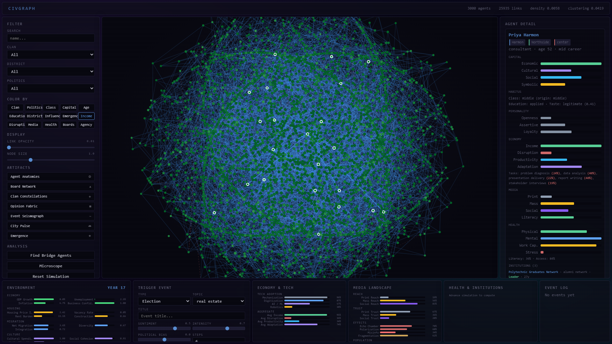

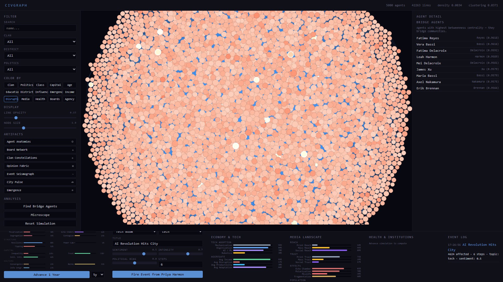

### Economy-environment coupling

Displacement risk feeds unemployment. AI adoption boosts GDP. Task-based income shapes economic capital. Health constrains work capacity and productivity. Board economic interests boost income. Skill currency (which decays 3%/year without refreshment) affects productivity.

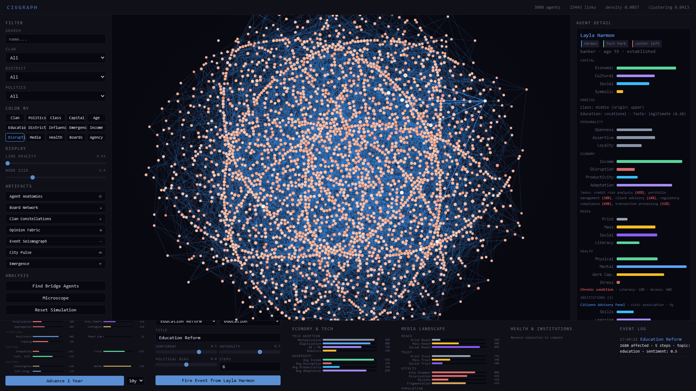

---

## Health System

Social determinants of health (Marmot 2005, WHO CSDH 2008): health outcomes are shaped by class, education, social networks, economic security, and working conditions -- not just biology.

### Per-agent health

- **Physical health** -- class gradient: each step up the class ladder means systematically better health. Declines with age, worsened by chronic conditions.
- **Mental health** -- buffered by social capital (Berkman & Syme 1979), eroded by displacement stress and job insecurity (Case & Deaton 2015, "deaths of despair").
- **Chronic conditions** -- age-dependent onset with class-weighted risk (lower class = 1.5x). Once developed, managed through healthcare access and health literacy.
- **Work capacity** -- derived from physical health, mental health, and disability. Directly constrains economic productivity.
- **Stress** -- accumulated from displacement risk, low satisfaction, economic insecurity. Buffered by social capital and economic security.

### Health color mode

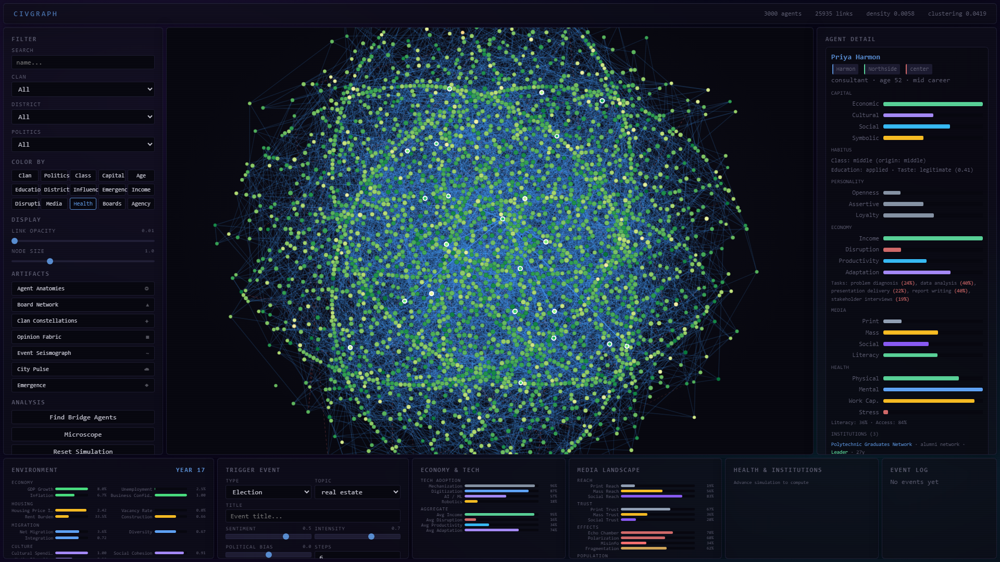

### Health environment indicators

Four macro indicators: healthcare access, life expectancy index, mental health index, and health inequality. Mental health tracks social cohesion and unemployment. Health inequality is moderated by healthcare access.

---

## Institutional Memberships

Agents participate in institutions beyond family and workplace. These create cross-cutting ties, concentrate power through interlocking directorates, generate economic interests, and shape capital accumulation.

### Eight institution types

| Type | Prestige | Economic benefit | Access pattern |
|---|---|---|---|
| **Professional boards** | Very high | High (board fees, deals) | Upper class, high economic capital |
| **Civic associations** | Moderate | Low | Broad, especially middle class |
| **Cultural clubs** | Moderate | Low | Education-driven, cultural capital |
| **Social clubs** | High | Moderate (networking) | Class-stratified, referral-based |
| **Political organizations** | Low-moderate | Low | Politically active agents |
| **Religious communities** | Low | Low (high social) | Broad, especially lower/middle |
| **Industry bodies** | Moderate | Moderate | Occupation-driven |
| **Alumni networks** | Moderate | Moderate | Education-track driven |

40+ named institutions (e.g., "City Development Corp", "Arts Patronage Circle", "Metropolitan Club", "Finance Roundtable"). Agents join 0-4 institutions based on occupation affinity, class, education, and interests.

### Interlocking directorates (Mizruchi 1996)

Shared board membership creates network ties with aligned economic interests. Leadership roles emerge with seniority and concentrate board power. Agents who sit on multiple professional boards accumulate disproportionate symbolic and economic capital.

### Boards color mode

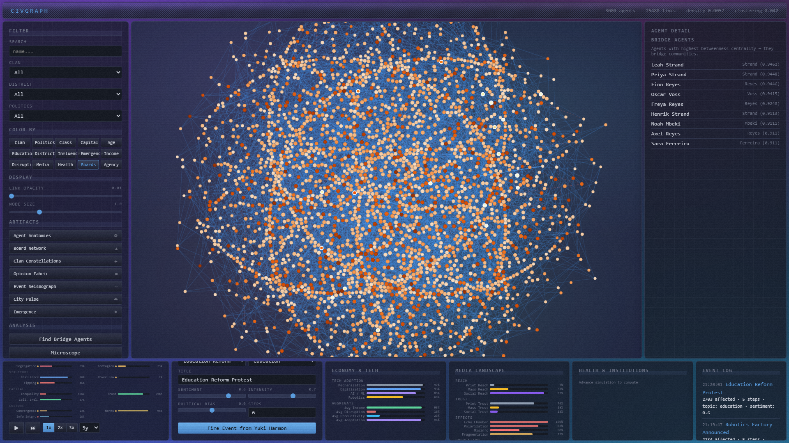

### Skill currency and lifelong learning

Skills decay ~3% per year without refreshment. Lifelong learning propensity (driven by education and age) and institutional membership (alumni networks, industry bodies) offset this decay. Skill currency directly affects productivity.

---

## Agency Dynamics (STS)

Drawing on Actor-Network Theory (Latour 2005, Callon 1986, Law 1987), CivGraph treats the simulation not as a system of human agents in a passive environment, but as a heterogeneous assemblage of human and non-human actants engaged in continuous processes of translation, enrollment, and stabilization.

### Non-human actants (Latour)

Technologies, media platforms, and institutions are not passive context -- they are actants with computed agency scores. AI/ML at 18% adoption has agency 0.14; social media at 68% reach has agency 0.64 despite low trust (algorithmic power operates independently of credibility). Mechanization at 95% adoption has agency 0.76 but is almost entirely black-boxed.

### Translation dynamics (Callon)

Events undergo translation as they propagate through the network. Each intermediary agent reframes the event based on their interests, institutional position, and political orientation -- Callon's four moments of translation (problematization, interessement, enrolment, mobilization) are operationalized as computed shifts in sentiment, topic framing, and institutional weight.

### Obligatory passage points (Callon)

Beyond Burt's (1992) structural holes, OPPs combine betweenness centrality with institutional gatekeeping power, clan/district diversity, and symbolic legitimacy. Board chairs who also bridge communities become unavoidable intermediaries through whom information and influence must pass.

### Performativity (Callon 1998, MacKenzie 2006)

The model measures how its own categories become self-fulfilling. Class performativity tracks whether agents' economic capital, cultural taste, and network homophily align with their class label. High performativity means categories actively shape behavior -- economics as "engine, not camera."

### Black-boxing (Latour)

Crystallized norms, established institutions, and mature technologies become invisible infrastructure. Black-boxed elements resist change but can be "opened" by crises, scandals, or technological disruption. The model tracks black-boxing across norms, institutions, and technology maturity.

### Centers of calculation (Latour)

Agents who accumulate information from across the network through institutional diversity, network reach, and processing capacity. They achieve power by being able to "see" more of the network than anyone else.

### Network programmers and switchers (Castells 2009)

Programmers set the agenda (high symbolic capital + institutional leadership). Switchers connect otherwise separate worlds (high betweenness + cross-type institutional membership across different domains).

### Agency color mode

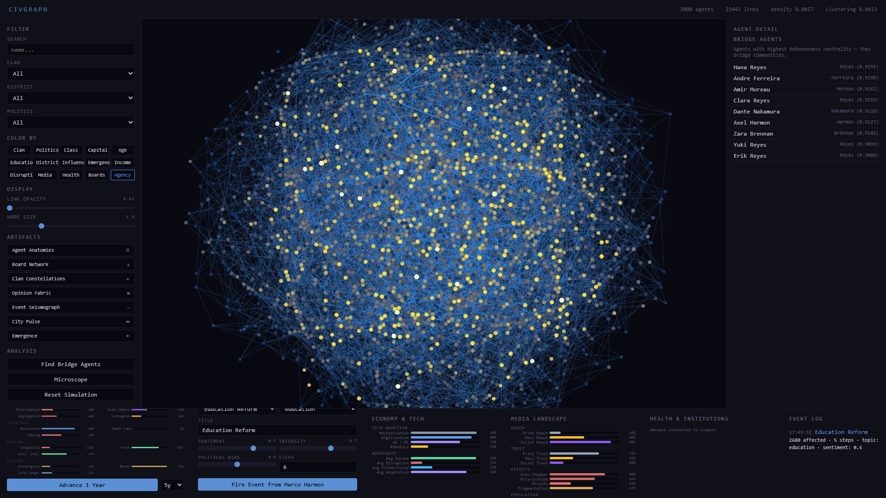

The **Agency** color mode reveals the structural power topology -- who controls the flows. Lighter nodes are obligatory passage points where information and influence converge.

---

## Media Dynamics

Three media ecosystems shape how information flows, opinions form, and events propagate.

- **Print media** -- declining reach (~2.5%/yr), high trust, analytical depth. Pulls opinions toward moderation.
- **Mass media** -- broad reach, homogenizes opinions toward mainstream consensus. Rising sensationalism.
- **Social media** -- growing toward 95% saturation, echo chambers deepen with engagement, polarization amplifier, viral dynamics.

### Media color mode

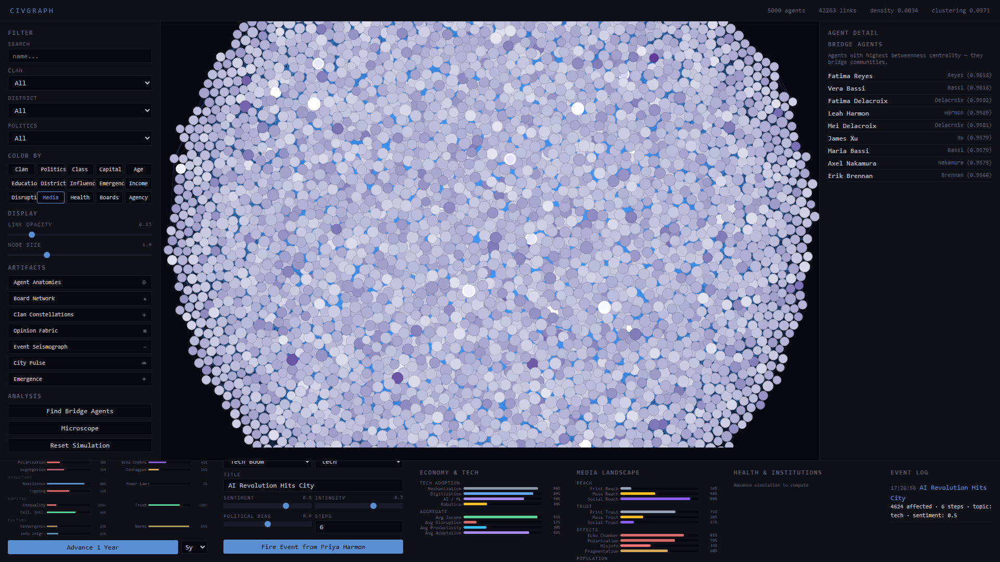

Each agent has a media consumption profile (print/mass/social exposure, media literacy, algorithmic bubble depth) shaped by age, education, class, and social capital. Media amplifies or dampens event propagation per agent.

---

## Microscope: Atomic Transaction Stream

The Microscope opens in a separate window and reveals every individual interaction during a simulation tick — the atomic transactions that are normally invisible inside the black box of a year's evolution.

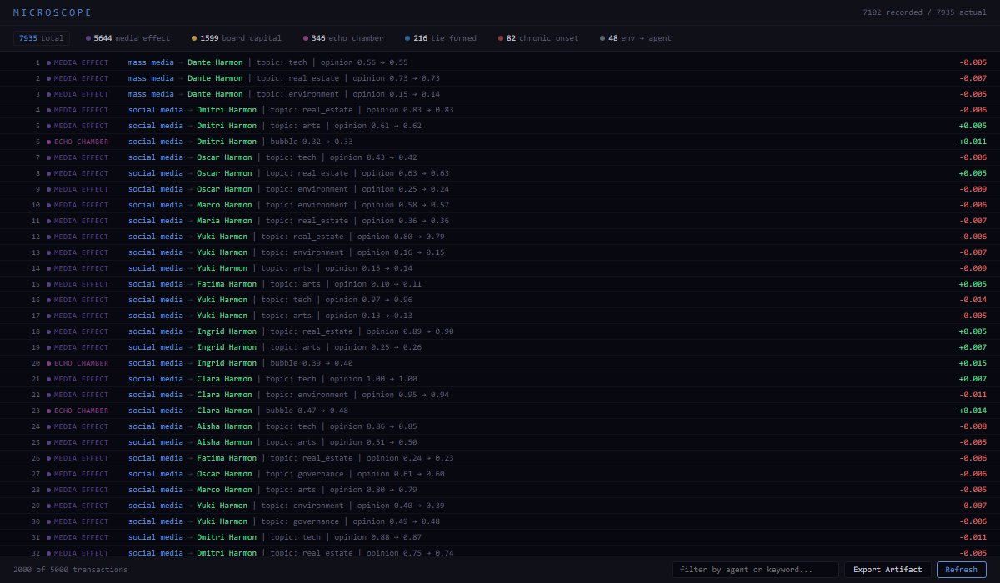

Each row records a single interaction: media effects shifting an agent's opinion on a topic, social media deepening an algorithmic bubble, a technology actant displacing a task, a chronic condition onset, an institution accumulating capital for a board member. Sources include non-human actants (Latour): AI/ML, social media, mass media, institutional structures.

- **Color-coded type chips** in the summary bar (click to filter)
- **Search** by agent name or keyword
- **Click any row** to highlight the agents in the main graph window
- **Export** as "Ledger of Transactions" (Plate VIII) in the engraving aesthetic

---

## Events and Influence Propagation

Events ripple through the social graph via a BFS cascade with decay. Reaction strength depends on capital field relevance, political alignment, habitus disposition, social capital threshold, clan loyalty, and media amplification.


### Bridge agents

Betweenness centrality identifies structural-hole brokers.


---

## Macro-Environment

26 time-varying indicators across 7 domains, all bidirectionally coupled with agents.

| Domain | Indicators |
|---|---|
| **Economy** | GDP growth, unemployment, inflation, business confidence |
| **Housing** | Price index, vacancy rate, rent burden, construction |
| **Migration** | Net migration, diversity, integration |
| **Culture** | Cultural spending, social cohesion, media pluralism |
| **Governance** | Public spending, corruption, policy stability, democratic quality |
| **Health** | Healthcare access, life expectancy, mental health index, health inequality |
| **Institutions** | Education quality, vocational training, civic participation, associational density |


---

## Emergent Properties

Thirteen macro-phenomena computed from micro-level interactions, with bidirectional coupling, downward causation, adaptive network rewiring, norm emergence, and Schelling segregation.

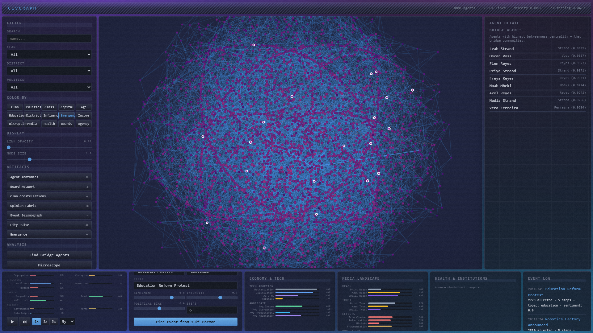

| # | Dimension | Research basis |
|---|---|---|
| 1 | Polarization | Esteban & Ray 1994 |
| 2 | Inequality | Piketty 2014, Merton 1968 |
| 3 | Collective Intelligence | Woolley et al. 2010 |
| 4 | Contagion Risk | Watts 2002 |
| 5 | Network Resilience | Barabasi 2002 |
| 6 | Phase Transitions | Granovetter 1978 |
| 7 | Echo Chambers | Sunstein 2001 |
| 8 | Power Law | Barabasi & Albert 1999 |
| 9 | Institutional Trust | Putnam 2000 |
| 10 | Cultural Convergence | Henrich 2015 |
| 11 | Information Integration | Rosas et al. 2020 |
| 12 | Norm Emergence | Axelrod 1986 |
| 13 | Segregation | Schelling 1971 |

Per-agent emergence attribution (catalyst vs. constrained scores), critical slowing down detection, and inter-dimension coupling.

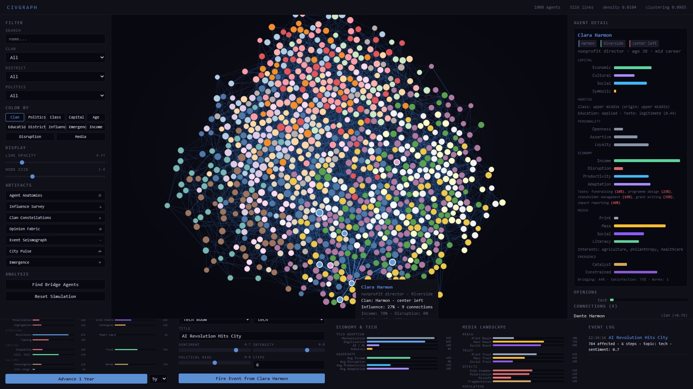

---

## Exportable Artifacts

Seven print-quality visualizations rendered to canvas in a 1960s German industrial / Swiss International Style aesthetic -- near-white backgrounds, sans-serif typography (Helvetica Neue / Arial), functional signal colors (Otl Aicher / Dieter Rams), DIN-style plate numbering, visible construction grids. All exportable as PNG or PDF at up to A2 300dpi. **Designed for pen-plotter output**: all marks are strokes, stipple dots, or crosshatching -- no gradients, no solid fills, no transparency blending. The screenshot tool fires 13 events across all types and advances 55 years in staggered phases so every artifact renders with fully populated data.

### Rhizome Anatomies (01)

Each of the city's 48 most influential agents rendered as a rhizome glyph (Deleuze & Guattari 1980, *A Thousand Plateaus*) on a visible construction grid. A root node represents the agent (size = influence x assertiveness), from which four primary tendrils grow outward encoding capital: green = economic, purple = cultural, blue = social, ochre = symbolic. Branch forks show interests diverging from each capital domain. Red thorns mark chronic conditions. Dotted runners indicate institutional ties. Political lean shifts the glyph laterally. Ink color = clan.


### Interlocking Directorates (02)

Bipartite network showing shared institutional memberships (Mizruchi 1996). Institutions on the left connected to agents on the right by membership lines. Color-coded by institution type (DB blue = professional boards, green = civic associations, purple = cultural clubs, ochre = social clubs, red = political orgs). Heavier lines = leadership roles. Circle size = membership count / influence. Reveals power concentration through who sits on which boards together.


### Constellations of Clan (03)

Scatter chart on a ruled survey grid. Each clan forms a constellation connected by minimum-spanning-tree lines. Horizontal axis = political leaning (far left to far right). Vertical axis = influence. Open circles with concentric target rings for high-influence agents. Cross-flares and 8-point stars mark the most influential. All marks are pen-plotter native strokes.

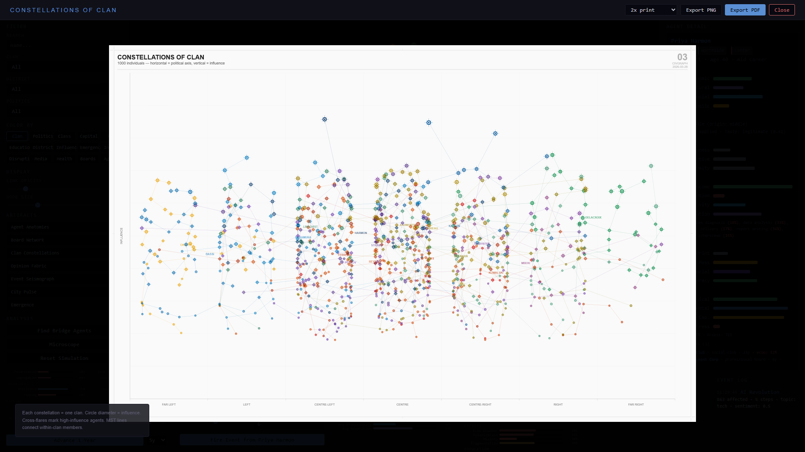

### Fabric of Opinion (04)

Matrix grid: rows = clans, columns = topics. Vertical green hatching = support, horizontal red hatching = opposition, perpendicular grey cross-hatch = internal clan disagreement. Density encodes opinion strength. Requires fired events to populate opinion data.

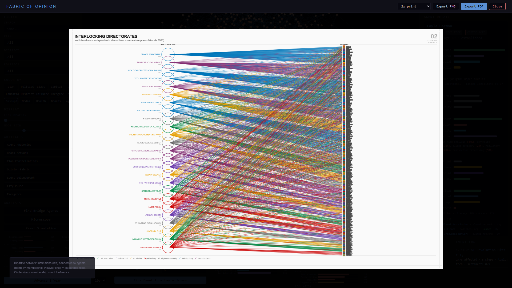

### Seismograph of Events (05)

Strip-chart waveforms showing cascade amplitude per propagation step. Each row = one event. Oscillation frequency increases with cascade depth. Green ink = positive sentiment, red = negative, grey = neutral. DIN-style step markers (S0, S1, S2...). Pure line work.

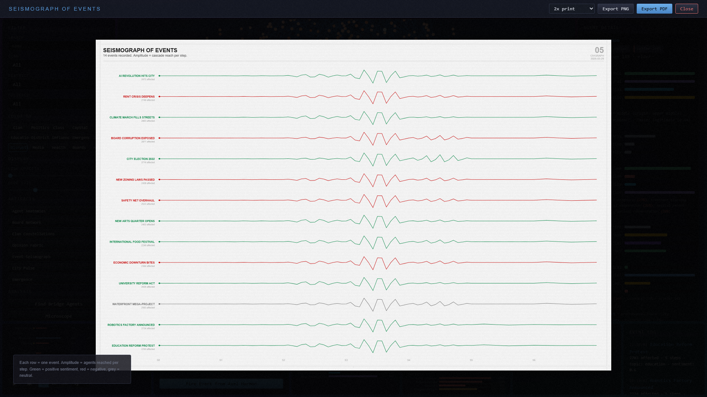

### Pulse of the City (06)

Seven domain strips (economy, housing, migration, culture, governance, health, institutions) showing all 26 environment indicators as overlapping ink traces. Diagonal crosshatch fill below lead traces. Domain labels in semibold uppercase. Year axis at bottom.


### Observatory of Emergence (07)

13-dimension radar chart with crosshatch-filled polygon (no solid fills). Concentric rings at 20% intervals. 7+6 detail panels flanking the radar with dimension-colored bars (crosshatched, not filled), sub-metrics, research citations, trend arrows, and early warning badges (WATCH / WARNING / CRITICAL). Coupling web below the radar shows reinforcing (green) and dampening (red) feedback loops. Temporal sparklines at bottom track all dimensions over simulation years.

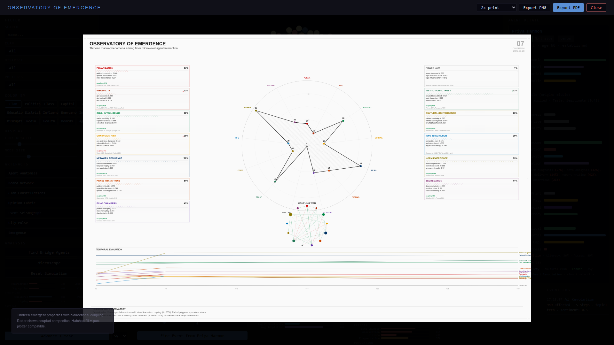

---

## Persistence and Portability

CivGraph saves and exports full simulation state for resumption, sharing, and external analysis.

### Save / Load

Save the complete simulation to a gzip-compressed JSON file (`.civgraph.json.gz`, typically 0.8 MB). Every agent's capital, habitus, economy, media, health, institutions, opinions, and norms are preserved at full precision. Load reconstructs the entire simulation state in ~50ms — including all 26 environment indicators, emergence history, media landscape, technology adoption levels, and event log. Auto-save can be configured to save every N ticks (keeps last 3 autosaves).

### Export for External Tools

| Format | Size | Use with |
|---|---|---|
| **CSV ZIP** | ~560 KB | R, pandas, Excel, SPSS, Stata — 6 flat tables: `agents.csv` (~50 columns), `edges.csv`, `environment_history.csv`, `emergence_history.csv`, `events.csv`, `memberships.csv` |
| **GEXF** | ~3.1 MB | **Gephi** (native format) — all agent attributes as node properties for filtering, coloring, sizing |
| **GraphML** | ~1.6 MB | **Gephi**, **yEd**, **Cytoscape**, **Neo4j**, **igraph** — universal graph exchange |
| **JSON** | ~0.8 MB | Any programming language, **D3.js**, **Observable**, **Jupyter** |

### Starting Fresh

`POST /api/reset?seed=N` generates a new city from scratch with a different random seed. Previous saves are preserved — you can explore multiple seeds and load back to any saved state.

---

## Architecture

```
agency.py        -- STS agency dynamics: non-human actants (Latour),
                    translation (Callon), obligatory passage points,
                    performativity (Callon/MacKenzie), black-boxing,
                    centers of calculation, heterogeneous engineering
                    (Law), network programmers/switchers (Castells).
health.py        -- Social determinants of health: per-agent physical,
                    mental, stress, work capacity, chronic conditions.
                    Marmot class gradient, Berkman social buffering,
                    Case & Deaton displacement stress.
institutions.py  -- 8 institution types (boards, clubs, associations),
                    40+ named institutions, interlocking directorates,
                    leadership emergence, skill currency, lifelong
                    learning, civic participation, board power.
economy.py       -- 20 occupations x 3-5 tasks, 4 tech waves,
                    Autor framework, S-curve adoption, per-agent
                    disruption, income, productivity.
media.py         -- Print/mass/social media ecosystems, per-agent
                    consumption, algorithmic bubbles, echo chambers,
                    media-event amplification.
emergence.py     -- 13-dimension emergent properties, downward
                    causation, adaptive rewiring, norms, Schelling
                    segregation, coupling matrix, critical slowing.
environment.py   -- 26 indicators across 7 domains, endogenous
                    dynamics, bidirectional agent coupling.
capital.py       -- Bourdieu's four capitals, habitus, lifecycle,
                    intergenerational transmission.
model.py         -- Agent dataclass, city generator (3,000 agents,
                    9 edge types), D3 export.
events.py        -- Capital-aware BFS propagation, media amplification,
                    coalition detection.
transactions.py  -- Atomic transaction ledger for Microscope view.
persistence.py   -- Save/load (gzip JSON), CSV/GEXF/GraphML export,
                    auto-save, Gephi-compatible graph export.
server.py        -- FastAPI REST + WebSocket, 45+ endpoints.
static/          -- D3.js frontend (15 color modes, 7 pen-plotter
                    artifacts, Microscope, 6-panel dashboard).
screenshot.py    -- Playwright screenshot tool: UI-driven warmup
                    fires 13 events and advances 55 years in
                    staggered phases to populate all artifacts.
                    (--artifacts-only, --port, --no-tick).
```

## API

| Endpoint | Description |
|---|---|
| `GET /api/graph` | Full graph (nodes with all agent systems, edges with types) |
| `GET /api/stats` | Network statistics + class distribution + capital averages |
| `GET /api/agent/{id}` | Agent detail (all systems + neighbors + emergence) |
| `GET /api/search` | Search by name, clan, district, politics |
| `GET /api/meta` | All metadata (clans, districts, occupations, institution types, etc.) |
| `POST /api/event` | Trigger event with media-amplified propagation |
| `POST /api/tick` | Advance 1-10 years (economy, media, health, institutions, emergence) |
| `POST /api/reset` | Reset with new seed |
| `GET /api/economy` | Tech state, aggregate stats, per-occupation breakdown |
| `GET /api/economy/occupations` | Task decomposition for all 20 occupations |
| `GET /api/media` | Media landscape + consumption statistics |
| `GET /api/health` | Aggregate health stats with class breakdown |
| `GET /api/institutions` | Institutional stats + top institutions by membership |
| `GET /api/institutions/types` | Institution type profiles and named instances |
| `GET /api/environment` | Current 26 macro indicators |
| `GET /api/emergence` | 13-dimension emergence state with coupling and warnings |
| `GET /api/sts` | Full STS snapshot: actants, OPPs, performativity, black-boxing, alignment |
| `GET /api/sts/passage-points` | Top 20 obligatory passage points (Callon) |
| `GET /api/sts/network-capital` | Network programmers and switchers (Castells) |
| `GET /api/transactions` | Atomic transaction ledger from last tick |
| `POST /api/save` | Save simulation state to disk (.civgraph.json.gz) |
| `GET /api/saves` | List available save files with metadata |
| `POST /api/load` | Load simulation from save file |
| `DELETE /api/saves/{f}` | Delete a save file |
| `GET /api/export/csv` | Download CSV ZIP (agents, edges, history, memberships) |
| `GET /api/export/gexf` | Download GEXF (Gephi native format) |
| `GET /api/export/graphml` | Download GraphML (universal graph exchange) |
| `GET/POST /api/autosave` | Configure auto-save (enabled, interval) |
| `WS /ws` | WebSocket for live propagation animation |
