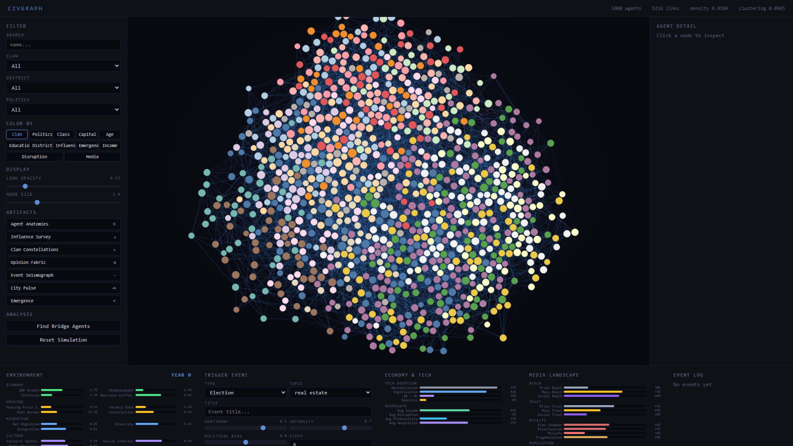
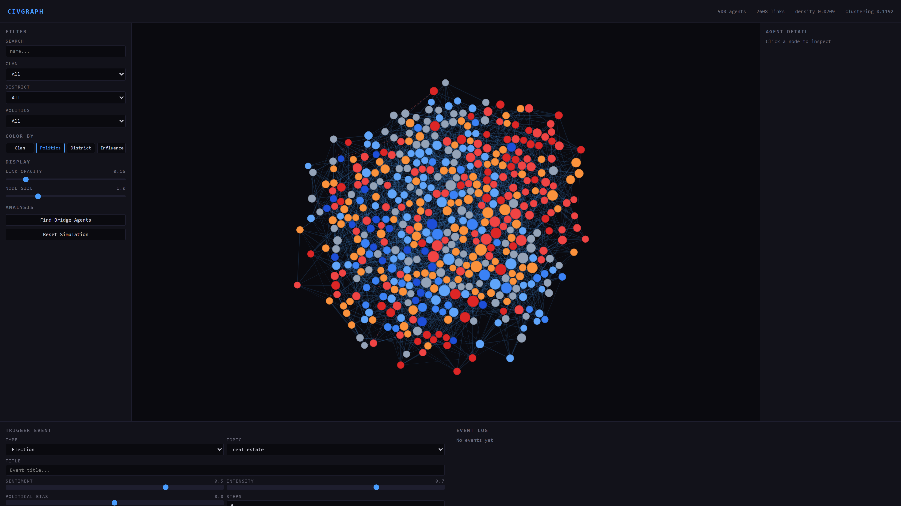
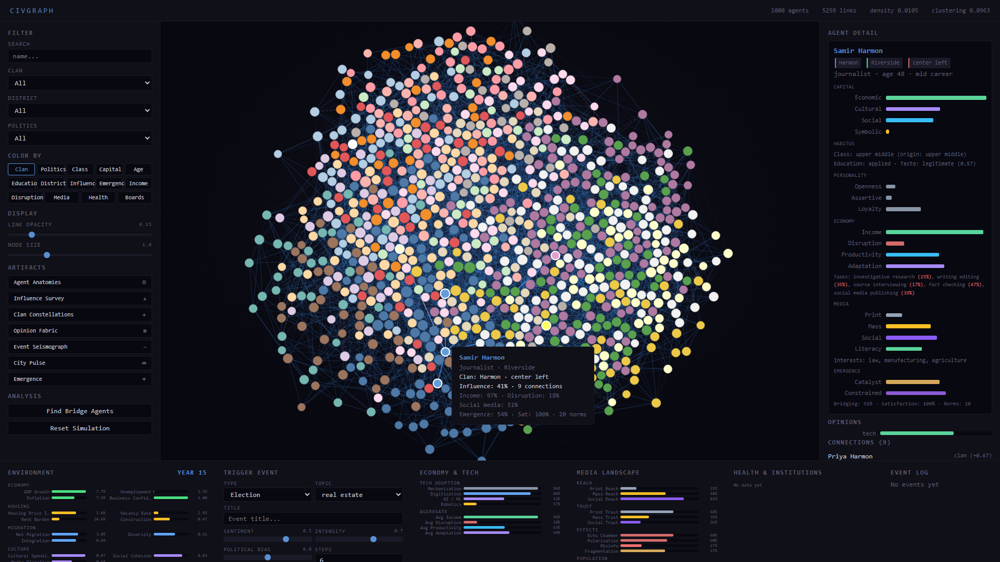
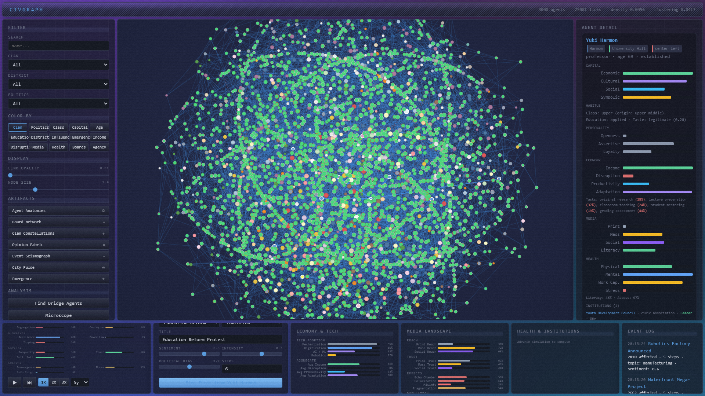
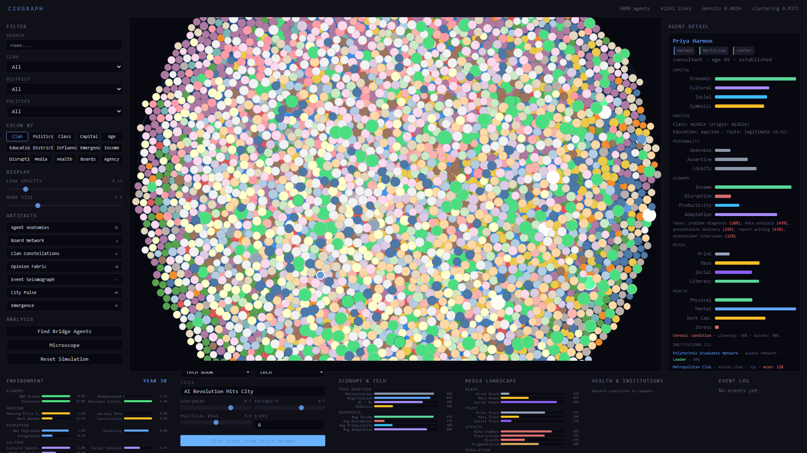
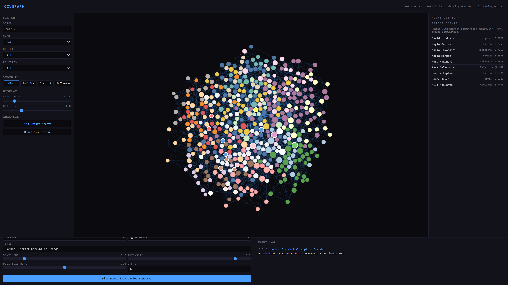
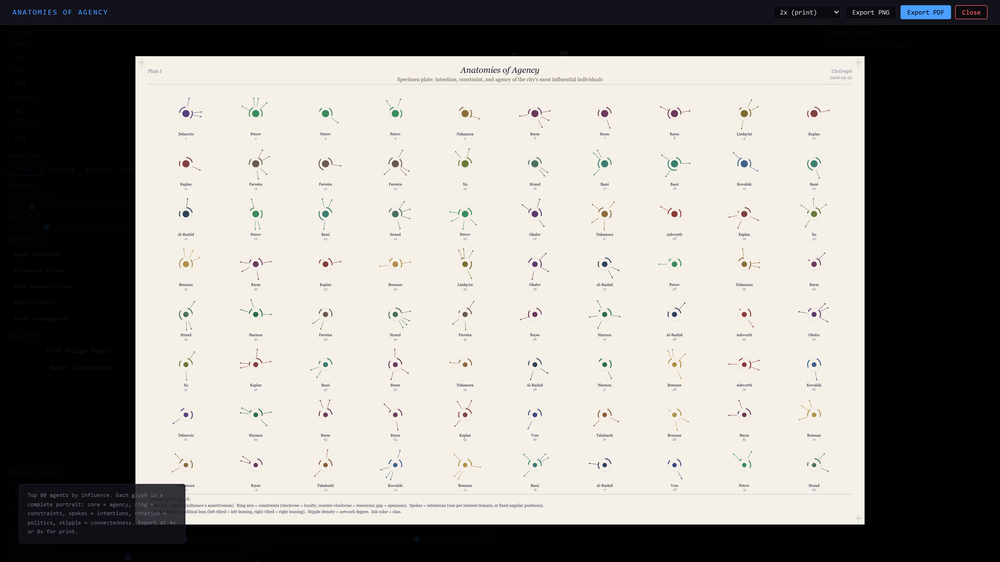
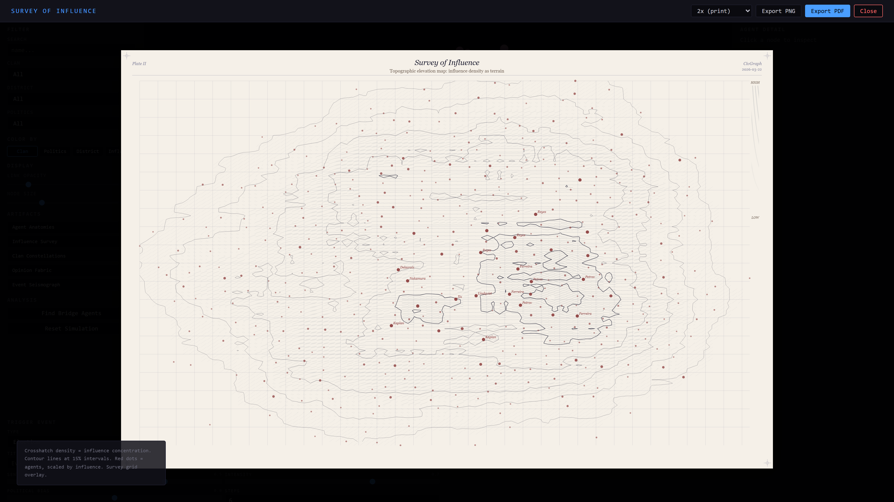
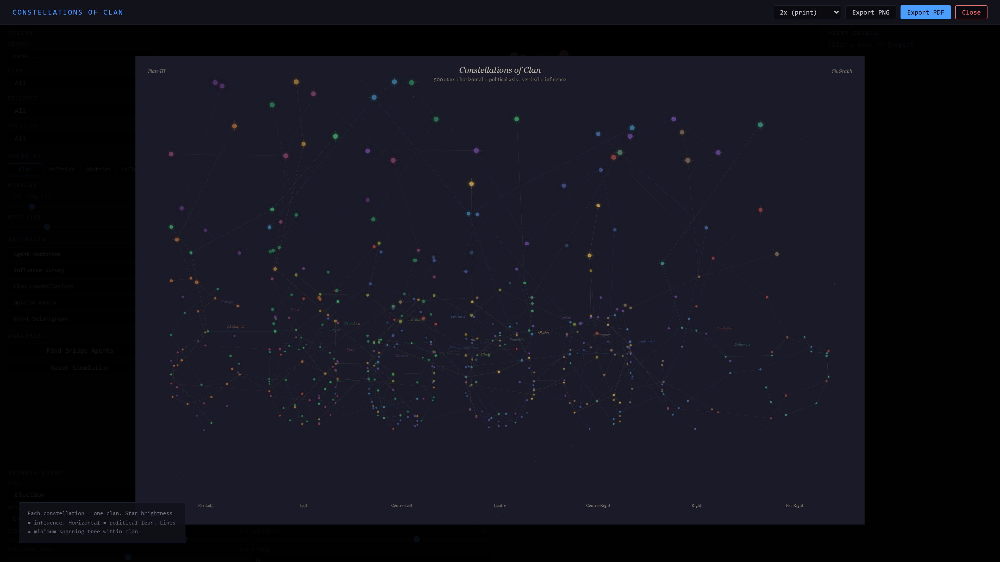

# CivGraph

Agent-based modeling on a social graph. Simulates 500 influential people in a mid-scale city with clan ties, political leanings, professional networks, and district connections. Watch influence cascade through the network in real time.



## Quick Start

```bash
pip install -r requirements.txt
python run.py
# Open http://localhost:8420
```

## The Graph

500 agents connected by 2,600+ weighted edges across 6 relationship types. The force-directed layout clusters tightly-knit communities together and pushes rivals apart. Zoom, pan, and drag nodes to explore the network.

### Color by political leaning

Switch to **Politics** mode to see the ideological landscape. Red = left, blue = right, gray = center. Notice how political clusters overlap with but don't perfectly mirror clan boundaries.



### Inspect any agent

Click a node to see their full profile: clan, district, occupation, personality traits (openness, assertiveness, loyalty), influence score, and all connections sorted by relationship weight. The right panel shows bar charts for each trait and lists neighbors with their relationship type.



### Fire events and watch influence propagate

Select an origin agent, configure an event (type, topic, sentiment, intensity, political bias), and fire it. Influence cascades outward through the network — agents flash green (support) or red (oppose) as the event reaches them. Each agent's reaction depends on their political alignment, clan loyalty, personality, and the trust weight of the edge that carried the information.



The event log tracks every event with impact metrics: how many agents were affected, how many propagation steps occurred, and the sentiment breakdown.



### Find bridge agents

Identify the people who connect otherwise disconnected communities. Bridge agents have the highest betweenness centrality — they are the gatekeepers through which information and influence must travel between clusters.



## Exportable Artifacts

Five print-resolution visualizations rendered to canvas, exportable as high-res PNG or PDF at up to 8x resolution (poster quality). The aesthetic draws from scientific engraving and naturalist specimen plates — ivory paper, fine ink lines, crosshatching, serif typography — rather than the typical tech-dashboard look.

### Anatomies of Agency

The hero artifact. Each of the city's 80 most influential agents is rendered as a unique radial glyph — a complete visual portrait encoding three dimensions of the individual:

- **Agency** (core dot) — radius proportional to influence multiplied by assertiveness. How much this person can actually move the needle.
- **Constraint** (ring arcs) — loyalty fills the ring clockwise, resources fill it counter-clockwise. The gap between arcs is proportional to openness: a narrow gap means a rigid, hard-to-sway agent; a wide gap means a receptive one.
- **Intention** (outer spokes) — each spoke points to one of 20 fixed interest-domain positions (like hours on a clock). The pattern of spokes reveals what this person cares about.
- **Political lean** — the entire glyph is rotated: left-leaning agents tilt left, right-leaning tilt right.
- **Connectedness** — stipple density within the glyph encodes network degree.
- **Clan** — ink color.

No two glyphs are alike. The plate reads like a page from a 19th-century naturalist's field journal.



### Survey of Influence

Topographic elevation map of influence density across the network. Agent positions from the force-directed layout become terrain coordinates; influence radiates outward via Gaussian kernel density estimation. Rendered with crosshatched elevation bands and ink contour lines at 15% intervals, with red survey markers for each agent.



### Constellations of Clan

Astronomical star chart. Each clan forms a constellation connected by minimum-spanning-tree lines. The horizontal axis is political leaning (far left to far right), the vertical axis is influence. Star brightness and size scale with influence; high-influence agents get cross-flares.



### Opinion Fabric and Event Seismograph

Two additional artifacts available after firing events:

- **Opinion Fabric** — a woven-textile grid (rows = clans, columns = topics). Vertical green hatching = support, horizontal red hatching = opposition. Perpendicular cross-hatch in sepia reveals internal clan disagreement.
- **Event Seismograph** — strip-chart waveforms. Each fired event gets a row. Amplitude = cascade reach per propagation step. Oscillation frequency increases with depth.

All artifacts can be exported at 1x (screen), 2x (print), 4x (high-res), or 8x (poster) resolution via the modal toolbar.

## Social Theory

The simulation implements Pierre Bourdieu's capital framework, calibrated to Western European norms (France/Germany/Netherlands averages).

### Four capitals

Each agent carries four distinct forms of capital:

- **Economic** — wealth, income, property. Beta-distributed by social class (Gini target ~0.32). Peaks during mid-career phase. A welfare-state floor of 0.15 prevents anyone from dropping to zero.
- **Cultural** — education, credentials, taste. Strongly correlated with education track (vocational 0.20 base, elite 0.78). The stickiest capital across generations (intergenerational elasticity 0.50).
- **Social** — network position, who you know. Derived from actual graph degree after generation. Well-connected agents spread information faster (lower activation threshold).
- **Symbolic** — prestige, recognition, authority. Peaks in the established life phase (55-70). Partly inherited from clan reputation.

Influence is derived: `0.4 * symbolic + 0.3 * social + 0.2 * economic + 0.1 * cultural`.

### Habitus

Each agent has internalized dispositions shaped by class origin and education:

- **Cultural taste** (-1 popular to +1 legitimate) — correlated r=0.6 with origin class
- **Risk tolerance** — U-shaped by class (high at extremes, low in middle)
- **Institutional trust** — peaks in upper-middle class
- **Class awareness** — higher at class extremes
- **Aspiration gap** — difference between current and origin class position

Habitus affects event reactions: high institutional trust amplifies governance events, low risk tolerance dampens crisis responses, cultural taste amplifies arts/education reactions. Agents with similar habitus form cross-clan bonds (habitus affinity ties).

### Lifecycle

Five phases with capital multipliers:

| Phase | Ages | Economic | Cultural | Social | Symbolic |
|---|---|---|---|---|---|
| Education | 18-24 | 0.15 | 0.55 | 0.30 | 0.05 |
| Early career | 25-34 | 0.50 | 0.75 | 0.50 | 0.15 |
| Mid career | 35-54 | 1.00 | 0.90 | 0.80 | 0.50 |
| Established | 55-69 | 0.85 | 1.00 | 1.00 | 1.00 |
| Elder | 70+ | 0.70 | 0.95 | 0.75 | 0.90 |

### Intergenerational transmission

Within clans, agents aged 45+ are assigned as parents of agents under 30. Capital transmits with friction:

- **Economic**: transfer rate 0.65 (after inheritance tax, FR/DE/NL average), elasticity 0.35
- **Cultural**: elasticity 0.50 (Bourdieu's key finding — cultural capital is more hereditary than economic)
- **Symbolic**: 30% from parent + 20% from clan average (family name carries weight)
- **Habitus**: child inherits parent's cultural taste (0.6 weight), institutional trust (0.5), risk tolerance (0.4)
- **Education track**: class-correlated probability tables (upper class: 35% elite, 45% academic; lower class: 60% vocational, 9% academic)

### Class structure

20 clans are assigned class centers (Delacroix = upper, Kowalski = lower). Individual agents deviate with noise, creating realistic within-clan variation. The resulting distribution targets Western European patterns:

| Class | Target share |
|---|---|
| Upper | 5% |
| Upper-middle | 15% |
| Middle | 40% |
| Lower-middle | 25% |
| Lower | 15% |

## Macro-Environment

18 time-varying indicators across 5 domains model the city's macro context. These evolve each tick (year) through internal dynamics and bidirectional coupling with agents.

| Domain | Indicators | Key dynamics |
|---|---|---|
| Economy | GDP growth, unemployment, inflation, business confidence | Okun's law, Phillips curve, confidence feedback |
| Housing | Price index, vacancy rate, rent burden, construction | Price/vacancy/construction feedback loop |
| Migration | Net migration, diversity, integration | Attracted by jobs, repelled by high rents |
| Culture | Cultural spending, social cohesion, media pluralism | Cohesion eroded by inequality, boosted by integration |
| Governance | Public spending, corruption, policy stability, democratic quality | Corruption mean-reverts, democratic quality tracks cohesion |

### Coupling with agents

- **Economy -> Agents**: GDP growth raises economic capital (proportional to existing wealth). Unemployment penalizes lower classes more (class-weighted). Inflation erodes unhedged savings.
- **Housing -> Agents**: Rent burden drains lower-capital agents directly.
- **Culture -> Agents**: Cultural spending boosts cultural capital. Social cohesion boosts social capital.
- **Governance -> Agents**: Democratic quality legitimizes symbolic capital. Corruption devalues it. Agent habitus institutional_trust drifts toward democratic quality.
- **Agents -> Environment**: Average economic capital drives business confidence. Average symbolic capital supports democratic quality. Opinion polarization erodes social cohesion.
- **Events -> Environment**: Each event type shifts specific indicators (housing crisis: +12% price, +5% rent; scandal: +5% corruption; crisis: -1.5% GDP).

### Tick system

Advance the simulation 1-10 years at a time. Each year: evolve indicators, apply agent coupling, age all agents, recompute lifecycle phases and capital curves. Full history is recorded for the City Pulse artifact.

## What It Models

- **500 agents** — each with clan, district, occupation, political leaning, interests, four capitals, habitus, age, lifecycle phase, personality
- **18 macro-environment indicators** across 5 domains (economy, housing, migration, culture, governance), evolving over time with internal dynamics and agent coupling
- **20 clans** with power-law sizes, each anchored to a home district and a class center
- **10 districts** — agents have a 60% chance of living in their clan's home base
- **7 political leanings** — far left to far right, with clan-correlated tendencies
- **7 relationship types** — clan bonds, professional ties, political alliances, district neighbors, friendships, rivalries, habitus affinity
- **Influence propagation** — BFS cascade with capital-weighted reactions, habitus disposition filtering, and social-capital-modulated activation thresholds
- **13 event types** — elections, scandals, crises, protests, festivals, education reform, housing crises, cultural events, welfare reform, and more
- **Emergent coalitions** — detect groups that form around shared opinions after events

## Architecture

```
environment.py — Macro-environment model (18 indicators, 5 domains),
                 internal dynamics, agent coupling, event coupling, tick system
capital.py     — Bourdieusian capital types, habitus, lifecycle curves,
                 intergenerational transmission, EU calibration constants
model.py       — Agent dataclass, city generator (500 agents with capital/habitus),
                 graph queries, D3 export
events.py      — Event system, capital-aware influence propagation, coalition detection
server.py      — FastAPI REST + WebSocket API (Pydantic-validated, security-hardened)
static/        — D3.js frontend (8 color modes, capital bars, environment gauges,
                 6 exportable artifacts)
run.py         — Launcher (localhost-only)
```

## API

| Endpoint | Description |
|---|---|
| `GET /api/graph` | Full graph in D3 format |
| `GET /api/stats` | Network statistics |
| `GET /api/agent/{id}` | Agent detail + neighbors |
| `GET /api/search?q=&clan=&district=&politics=` | Search agents |
| `POST /api/event` | Trigger event and propagate |
| `GET /api/opinion/{topic}` | Opinion breakdown by clan/district/politics |
| `GET /api/bridges` | Top 20 bridge agents by betweenness centrality |
| `GET /api/coalitions/{topic}` | Emergent coalitions around a topic |
| `GET /api/influence_path/{source}/{target}` | Shortest influence path |
| `GET /api/environment` | Current macro-environment indicators |
| `GET /api/environment/history` | Full history of indicator snapshots |
| `GET /api/environment/meta` | Indicator metadata (labels, ranges, domains) |
| `POST /api/tick` | Advance simulation by N years (1-10) |
| `POST /api/reset?seed=N` | Reset with new random city + environment |
| `WS /ws` | WebSocket for live propagation animation |
