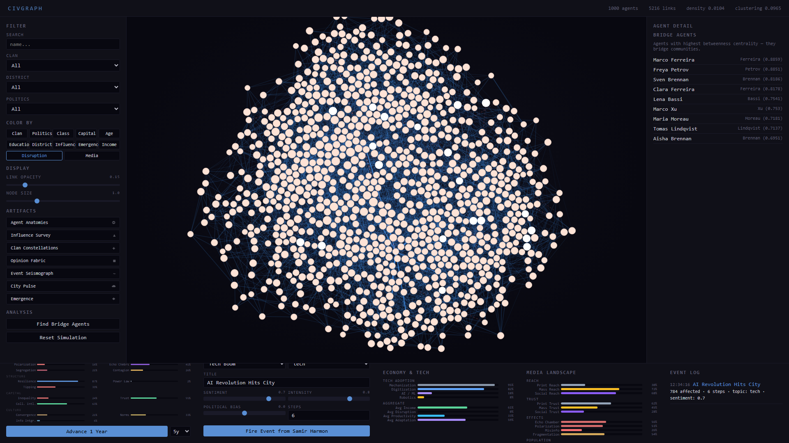

# CivGraph

An agent-based model of urban social dynamics, built on Pierre Bourdieu's theory of capital and habitus. 1,000 individuals in a mid-scale city form a living network where influence, opinion, and power flow through clan ties, professional bonds, and shared dispositions — shaped by macro forces of economy, housing, migration, culture, and governance, disrupted by waves of technological change, and refracted through the lenses of print, mass, and social media.


## Quick Start

```bash
pip install -r requirements.txt
python run.py
# http://localhost:8420
```

---

## Theoretical Foundations

CivGraph operationalizes concepts from Bourdieu's *Distinction* (1979) and *The Forms of Capital* (1986), Autor's task-content framework (2003), and McCombs & Shaw's agenda-setting theory (1972), combined with Granovetter's network embeddedness (1985) and Schelling-style emergent dynamics. The result is a simulation where macro-structural forces, technological disruption, media ecosystems, and micro-level dispositions produce stratification, coalition formation, and opinion cascades that mirror patterns observed in Western European cities.

### The four capitals

Bourdieu argued that social position is determined not by economic wealth alone, but by the interplay of multiple forms of capital. Each agent carries:

- **Economic capital** — wealth, income, property. Beta-distributed by social class with a Gini coefficient targeting ~0.32 (France/Germany average). A welfare-state floor of 0.15 prevents destitution — reflecting the social safety nets of the Rhineland model. Now dynamically shaped by task-based income and technological displacement.
- **Cultural capital** — education, credentials, cultivated taste. Strongly path-dependent on education track (vocational: 0.20 base, elite/grande ecole: 0.78). This is the stickiest capital across generations — with an intergenerational elasticity of 0.50, it reproduces class position more reliably than wealth does.
- **Social capital** — network position, bridging ties, trust relationships. Derived from actual graph degree after city generation. Agents with high social capital lower the activation threshold for information propagation — they are the connectors.
- **Symbolic capital** — prestige, recognition, authority. Peaks in the established life phase (55-70). Partly inherited from clan reputation. Legitimized by democratic quality, devalued by corruption.

Influence is a derived composite: `0.4 x symbolic + 0.3 x social + 0.2 x economic + 0.1 x cultural`.

### Habitus

Bourdieu's concept of *habitus* — the durable, transposable dispositions acquired through socialization — is modeled as a set of internalized traits shaped by class origin and education:

- **Cultural taste** (-1 popular to +1 legitimate) — correlated r ~ 0.6 with origin class. Determines who agents naturally gravitate toward.
- **Risk tolerance** — U-shaped by class: both upper classes (safety nets of wealth) and lower classes (nothing left to lose) show higher tolerance than the anxious middle.
- **Institutional trust** — peaks in the upper-middle class, where the system has most reliably worked in one's favor.
- **Class awareness** — stronger at class extremes, where the gap between one's position and the center is most felt.

Agents with similar habitus form bonds across clan boundaries (*habitus affinity ties*), reproducing Bourdieu's observation that class-based solidarity often cuts across ethnic and familial lines.

### Coloring the graph by social class

Switch to **Class** mode to see stratification. Brown/amber = lower and lower-middle, gray = middle, blue = upper-middle and upper. The clustering patterns reveal how class maps onto — but doesn't perfectly mirror — clan structure.


### Inspecting an individual

Click any node to see the full profile: four capital bars (economic, cultural, social, symbolic), habitus (origin class, current class, education track, cultural taste), personality traits, task-based economy (income, disruption risk, productivity, tech adaptation, individual task disruption percentages), and media consumption (print, mass, social exposure, media literacy, algorithmic bubble depth). The connections list shows relationship types and trust weights.


---

## Task-Based Economy and Technological Disruption

Each of the 20 occupations is decomposed into 3-5 concrete tasks — a doctor does patient diagnosis, treatment planning, physical examination, record-keeping, and patient communication; a contractor does project estimation, physical construction, crew supervision, blueprint interpretation, and permit management.

### Task anatomy

Every task sits on three axes that determine its vulnerability to automation:

- **Cognitive vs. manual** — is the work primarily mental or physical?
- **Routine vs. creative** — is it rule-following or judgment-requiring?
- **Interpersonal vs. solo** — does it require human-to-human interaction?

This follows Autor's (2003) task-content framework, extended for AI per Acemoglu & Restrepo (2019) and Eloundou et al. (2023, GPT exposure research).

### Four technology waves

Automation is not a single force — it arrives in waves, each with a different displacement profile:

| Wave | Adoption | Growth | Primary targets | Shield |
|---|---|---|---|---|
| **Mechanization** | ~95% (saturated) | Slow | Manual routine (assembly, farming) | Interpersonal tasks resist |
| **Digitization** | ~82% | Moderate | Cognitive routine (data entry, filing) | Creative work resists |
| **AI / ML** | ~18% (rapid growth) | Fast | Cognitive routine AND creative (writing, coding, diagnosis) | Interpersonal partially shields |
| **Robotics** | ~8% (early) | Moderate | Manual routine and some manual creative | High interpersonal shield |

Each wave follows a logistic S-curve. AI adoption starts at 18% and grows rapidly — within 15 simulated years it reaches ~50%, disrupting tasks that digitization left untouched (creative cognitive work like legal research, data analysis, writing, and even medical diagnosis).

### Income color mode

Switch to **Income** to see earning power distributed across the network. Green intensity maps to task-based income — a composite of task economic value, class-scaled market rates, technology productivity multipliers, and displacement effects.


### Disruption color mode

Switch to **Disruption** to see technological displacement risk. Red intensity shows how much of each agent's task portfolio is automatable under current technology. After advancing the simulation 15 years, AI adoption at ~50% visibly reddens cognitive-routine-heavy occupations (bankers, lawyers, consultants) while manual-interpersonal roles (restaurateurs, pastors, union leaders) remain lighter.



### Per-agent economic detail

The agent detail panel shows individual task disruption: each task is listed with its current disruption percentage. A consultant's "data analysis" task might show 45% disruption while their "stakeholder interviews" remain at 8% — the interpersonal axis protects face-to-face work.


### Economy-environment coupling

- Displacement risk feeds into the macro unemployment rate
- AI adoption boosts aggregate GDP growth (productivity gains)
- GDP growth feeds back into individual income
- High unemployment increases perceived displacement risk
- Task-based income shapes economic capital accumulation

---

## Media Dynamics

Three media ecosystems shape how information flows, opinions form, and events propagate through the city. Each operates with distinct reach, trust, speed, and polarization dynamics.

### Print media (newspapers, magazines, books)

- **Declining reach** (~2.5% annual erosion) but rising trust as it becomes a niche, loyalty-driven medium
- **High analytical depth** — promotes nuanced, moderate opinion formation
- Consumed more by educated, older, upper-class agents (Reuters Digital News Report patterns)
- Effect: pulls opinions toward moderation (regression to mean, weighted by trust and diversity)

### Mass media (television, radio)

- **Broad reach** but slowly eroding from social media competition
- **Homogenization** — creates shared narratives, pushes opinions toward a mainstream consensus
- Rising sensationalism as it competes for attention
- Effect: moderate trust, moderate polarization; everyone sees the same thing

### Social media (platforms, algorithmic feeds)

- **Growing reach** (logistic growth toward 95% saturation)
- **Echo chambers** — algorithmic filtering deepens over time as agents engage with content matching their existing opinions
- **Polarization amplifier** — extreme opinions get more engagement, feeding back into bubble depth
- **Viral dynamics** — random high-intensity opinion spikes bypass traditional gatekeeping
- **Influencer effects** — agents with high social capital amplify signals
- Consumed more by younger, socially connected agents
- Effect: reinforces existing positions, creates filter bubbles, amplifies events

### Media color mode

Switch to **Media** to see social media exposure and algorithmic bubble depth. Purple intensity reflects the combination of social media consumption and echo chamber immersion.


### Per-agent media consumption

Each agent has a media profile shaped by demographics:
- **Print exposure** — higher for educated, older agents (elite education: 0.65 base, vocational: 0.15)
- **Mass exposure** — broadly consumed with slight older skew
- **Social exposure** — higher for younger, high-social-capital agents
- **Media literacy** — primarily driven by education track; provides a shield against manipulation
- **Algorithmic bubble** — starts at zero, deepens with extreme opinions and social media engagement, naturally decays without engagement

### Media-event amplification

When events propagate through the network, media amplifies or dampens their reach per agent:
- Print media: modest boost through editorial trust
- Mass media: significant amplification for high-intensity events
- Social media: strongest amplification, especially for extreme content
- Media literacy provides partial protection against amplification

### Media-environment coupling

- Social media polarization erodes social cohesion
- Media pluralism is a composite of print diversity, echo chamber absence, and low misinformation
- Misinformation erodes democratic quality
- Economic downturns accelerate print media decline (advertising revenue loss)
- High corruption paradoxically deepens investigative journalism

---

## Events and Influence Propagation

Events ripple through the social graph via a BFS cascade with decay. Each agent's reaction depends on:

1. **Capital field relevance** — agents with capital matching the event's domain react more strongly
2. **Political alignment** — Gaussian-weighted distance between agent's politics and the event's bias
3. **Habitus disposition** — institutional trust amplifies governance reactions, risk tolerance dampens crisis responses
4. **Habitus affinity** — dispositional similarity between source and receiver amplifies the trust channel
5. **Social capital threshold** — well-connected agents spread information more readily
6. **Clan loyalty** — when an event targets an agent's own clan negatively, loyalty acts as a buffer
7. **Media amplification** — each agent's media consumption profile amplifies or dampens event reception


The event log tracks impact metrics. Each event also shifts macro-environment indicators — a tech boom boosts GDP, business confidence, and housing prices.


### Bridge agents

Betweenness centrality identifies the agents who connect otherwise disconnected communities — the brokers, translators, and gatekeepers through whom information and influence must pass.


---

## Macro-Environment

18 time-varying indicators across 5 domains model the city's structural context. These evolve endogenously through economic feedback loops (Okun's law, Phillips curve, housing supply/demand) and are bidirectionally coupled with agent capital, technological disruption, and media dynamics.

| Domain | Indicators | Key dynamics |
|---|---|---|
| **Economy** | GDP growth, unemployment, inflation, business confidence | Okun's law, Phillips curve, AI productivity boost, displacement → unemployment |
| **Housing** | Price index, vacancy rate, rent burden, construction | Supply/demand cycle, price-construction response |
| **Migration** | Net migration, diversity, integration | Attracted by jobs, repelled by rent burden |
| **Culture** | Cultural spending, social cohesion, media pluralism | Cohesion eroded by social media polarization, media pluralism from print diversity |
| **Governance** | Public spending, corruption, policy stability, democratic quality | Corruption mean-reverts; democratic quality eroded by misinformation |

### The bottom panel

The environment panel now includes five columns: **Environment** (18 macro indicators), **Trigger Event** (event controls), **Economy & Tech** (technology adoption curves and aggregate economic stats), **Media Landscape** (reach/trust/polarization gauges per media type), and **Event Log**.

Advance the simulation by 1-10 years at a time. Each tick ages all agents, evolves technology adoption (AI grows along its S-curve), evolves the media landscape (print declines, social grows, echo chambers deepen), recomputes task-based disruption and income, applies media effects on opinions, and runs the full environment coupling.


### Environment -> Agent coupling

- GDP growth raises economic capital proportional to existing wealth (the Matthew effect)
- Unemployment penalizes lower classes disproportionately (class-weighted)
- Inflation erodes unhedged savings (inverse wealth protection)
- Rent burden drains economic capital of those with less
- Cultural spending boosts cultural capital accumulation
- Democratic quality legitimizes symbolic capital; corruption devalues it
- Task-based income feeds economic capital; displacement risk drains it
- Media effects shift opinions per tick (print moderates, mass homogenizes, social polarizes)

### Agent -> Environment feedback

- Average economic capital drives business confidence
- Average symbolic capital supports democratic quality
- Opinion polarization (variance across agents) erodes social cohesion
- Average displacement risk feeds unemployment
- AI adoption boosts GDP growth

---

## Emergent Properties

Thirteen macro-phenomena are computed from micro-level agent interactions — properties that cannot be predicted from any single agent's state. The emergence engine runs bidirectionally: emergent properties are measured *and* feed back into agent behavior (downward causation), while agents reshape the network topology through adaptive rewiring.


### The thirteen dimensions

| # | Dimension | Research basis | What it measures |
|---|-----------|---------------|-----------------|
| 1 | **Polarization** | Esteban & Ray 1994, Axelrod 1997 | Political/opinion clustering into distant factions (Esteban-Ray index) |
| 2 | **Inequality** | Piketty 2014, Merton 1968 | Gini, Palma ratio, Matthew effect (cumulative advantage correlation) |
| 3 | **Collective Intelligence** | Woolley et al. 2010, Page 2007 | Group capacity from cognitive diversity, connectivity, and social sensitivity |
| 4 | **Contagion Risk** | Watts 2002, Christakis & Fowler 2009 | Cascade vulnerability — activation thresholds, hub reach, open-subgraph density |
| 5 | **Network Resilience** | Barabasi 2002, Albert et al. 2000 | Random robustness vs. targeted hub fragility, articulation point fraction |
| 6 | **Phase Transitions** | Granovetter 1978, Centola 2018 | Proximity to critical tipping points (25% threshold, mobility tension) |
| 7 | **Echo Chambers** | Sunstein 2001, Pariser 2011 | Political/class homophily, opinion modularity, clan insularity |
| 8 | **Power Law** | Barabasi & Albert 1999, Clauset et al. 2009 | Zipf/Pareto fits for degree, wealth, and influence distributions |
| 9 | **Institutional Trust** | Putnam 2000, Fukuyama 1995 | Generalized trust, bridging vs. bonding capital, civic engagement |
| 10 | **Cultural Convergence** | Henrich 2015, Boyd & Richerson 1985 | Within-group homogenization, generational taste drift, interest convergence |
| 11 | **Information Integration** | Rosas et al. 2020, Tononi 2004 | Mutual information, transfer entropy, synergy, integrated information (phi) |
| 12 | **Norm Emergence** | Axelrod 1986, Bicchieri 2006 | Norm crystallization rate, compliance, fragmentation across communities |
| 13 | **Segregation** | Schelling 1971, Fossett 2006 | Dissimilarity index, isolation index, class-spatial sorting, satisfaction |

### Inter-dimension coupling

Emergent properties don't exist in isolation — they form reinforcing and dampening feedback loops. A 13x13 coupling matrix drives these interactions:

- Polarization **amplifies** echo chambers (+0.15) and **erodes** institutional trust (-0.10)
- Inequality **fuels** phase transitions (+0.12) and **drives** segregation (+0.10)
- Echo chambers **reduce** collective intelligence (-0.10) and **reinforce** polarization (+0.12)
- Institutional trust **strengthens** resilience (+0.10) and **dampens** contagion risk (-0.08)
- Norm emergence **builds** trust (+0.08) and **promotes** cultural convergence (+0.06)

### Downward causation

Emergence is not epiphenomenal in CivGraph — macro-level patterns actively constrain and enable agents:

- **Polarization > 0.3** reduces cross-group openness and increases assertiveness
- **Inequality > 0.4** raises class awareness and reduces risk tolerance for lower classes
- **Echo chambers > 0.3** further reduces openness (information filtering)
- **Low institutional trust < 0.4** erodes individual trust
- **High contagion > 0.5** raises openness (susceptibility)
- **Segregation > 0.3** reduces satisfaction for minority-position agents

### Adaptive network rewiring (Gross & Blasius 2008)

Each tick, 5% of agents consider rewiring:
1. **Opinion-driven dissolution** — drop ties to strong disagreers
2. **Homophily-driven formation** — form ties to politically/culturally similar unconnected agents
3. **Triadic closure** — friends-of-friends become friends
4. **Weak tie decay** — very low weight edges dissolve stochastically

### Norm emergence, Schelling segregation, and critical slowing down

- **Norms** crystallize from repeated interaction — local averaging, compliance pressure, sanctions for deviance
- **Segregation** dynamics: agents with low satisfaction (< 35% in-group neighbors) relocate to more satisfactory districts
- **Early warning signals** detect approaching regime shifts via rising autocorrelation, variance, and flickering

### Per-agent emergence attribution

Every agent receives two scores:
- **Catalyst** — how much this agent contributes to emergent dynamics
- **Constrained** — how much macro patterns shape this agent


### Observatory of Emergence (Plate VII)


The emergence artifact renders all 13 dimensions as a central radar chart with historical overlays, side panels showing sub-metrics and research citations, a coupling web visualization, and temporal sparklines.

---

## Lifecycle and Intergenerational Transmission

Five phases with capital multipliers reflecting empirical Western European life-course patterns:

| Phase | Ages | Economic | Cultural | Social | Symbolic |
|---|---|---|---|---|---|
| Education | 18-24 | 0.15 | 0.55 | 0.30 | 0.05 |
| Early career | 25-34 | 0.50 | 0.75 | 0.50 | 0.15 |
| Mid career | 35-54 | 1.00 | 0.90 | 0.80 | 0.50 |
| Established | 55-69 | 0.85 | 1.00 | 1.00 | 1.00 |
| Elder | 70+ | 0.70 | 0.95 | 0.75 | 0.90 |

Within clans, agents aged 45+ are assigned as parents of agents under 30. Capital transmits with friction:

- **Economic**: transfer rate 0.65 (after inheritance tax, FR/DE/NL average), intergenerational elasticity 0.35
- **Cultural**: elasticity 0.50 — Bourdieu's central finding that cultural capital reproduces class position more reliably than wealth
- **Symbolic**: 30% from parent, 20% from clan average (the family name effect)
- **Habitus**: child inherits parent's cultural taste (0.6), institutional trust (0.5), risk tolerance (0.4)
- **Education track**: class-correlated probability tables calibrated to FR/DE patterns

### Class structure

20 clans are assigned class centers (Delacroix = 3.8/upper, Kowalski = 1.1/lower). Individual members deviate with noise, creating realistic within-clan variation while preserving the correlation between family origin and class position.

---

## Exportable Artifacts

Seven print-quality visualizations rendered to canvas in a scientific engraving aesthetic. All exportable as PNG or PDF, including **A2 300dpi** presets for archival-quality prints.

### Anatomies of Agency (Plate I)

Each of the city's 80 most influential agents rendered as a unique radial glyph. Four colored quadrant arcs encode capital. Radiating spokes mark interest domains. Core dot sizes by agency. Political lean rotates the glyph. Stipple density encodes network degree. Ink color = clan.


### Survey of Influence (Plate II)

Gaussian kernel density estimation over force-layout positions. Influence radiates as terrain elevation with crosshatched bands and ink contour lines.


### Constellations of Clan (Plate III)

Star chart. Each clan is a constellation. Horizontal axis = political leaning. Vertical axis = influence. Star brightness scales with influence.


### Pulse of the City (Plate VI)

Layered time-series strips showing all 18 environment indicators evolving over simulation years.


### Additional artifacts

- **Fabric of Opinion** (Plate IV) — woven-textile grid of opinions by clan and topic
- **Seismograph of Events** (Plate V) — cascade amplitude waveforms per propagation step
- **Observatory of Emergence** (Plate VII) — 13-dimension radar chart with coupling web

---

## Architecture

```
economy.py     — Task-based economic model: 20 occupations x 3-5 tasks,
                 4 technology waves (mechanization, digitization, AI/ML,
                 robotics), Autor task-content framework, S-curve adoption,
                 per-agent disruption, income, and productivity
media.py       — Media dynamics: print (declining, trusted, deep), mass
                 (broad, homogenizing), social (growing, echo chambers,
                 polarization). Per-agent consumption profiles,
                 algorithmic bubble formation, media-event amplification,
                 bidirectional environment coupling
emergence.py   — 13-dimension emergent properties engine: polarization,
                 inequality, collective intelligence, contagion, resilience,
                 phase transitions, echo chambers, power law, trust,
                 cultural convergence, information-theoretic, norms,
                 segregation. Plus: downward causation, adaptive rewiring,
                 norm dynamics, Schelling segregation, inter-dimension
                 coupling, critical slowing down, per-agent attribution
environment.py — 18-indicator macro model, internal dynamics (Okun, Phillips,
                 supply/demand), bidirectional agent coupling, tech and
                 media integration, event coupling
capital.py     — Bourdieu's four capitals, habitus, lifecycle curves,
                 intergenerational transmission, Western European calibration
model.py       — Agent dataclass (capital, habitus, economy, media, norms,
                 satisfaction, emergence score), city generator (1,000
                 agents, 7 edge types, class-stratified clans), D3 export
events.py      — Event system, capital-aware BFS propagation, habitus
                 disposition filtering, media amplification, coalition
                 detection
server.py      — FastAPI REST + WebSocket API, Pydantic validation,
                 security-hardened (XSS, CSRF, origin checking)
static/        — D3.js frontend (12 color modes, 7 artifacts, economy &
                 media dashboards, emergence gauges, A2 print export)
run.py         — Launcher (localhost-only)
```

## API

| Endpoint | Description |
|---|---|
| `GET /api/graph` | Full graph (nodes with capital/habitus/economy/media, edges with types) |
| `GET /api/stats` | Network statistics + class distribution + capital averages |
| `GET /api/agent/{id}` | Agent detail (capital, habitus, economy, media, neighbors, emergence) |
| `GET /api/search` | Search by name, clan, district, politics |
| `GET /api/meta` | Metadata (clans, districts, classes, occupations, tech waves, media types) |
| `POST /api/event` | Trigger event with capital-aware, media-amplified propagation |
| `GET /api/opinion/{topic}` | Opinion breakdown by clan/district/politics |
| `GET /api/bridges` | Top 20 bridge agents by betweenness centrality |
| `GET /api/coalitions/{topic}` | Emergent coalitions around a topic |
| `GET /api/influence_path/{a}/{b}` | Shortest influence path between agents |
| `GET /api/environment` | Current macro-environment indicators |
| `GET /api/environment/history` | Full indicator history (for City Pulse artifact) |
| `GET /api/environment/meta` | Indicator metadata (labels, ranges, domains) |
| `POST /api/tick` | Advance simulation 1-10 years (economy, media, emergence dynamics) |
| `POST /api/reset?seed=N` | Reset city + environment + economy + media + emergence |
| `GET /api/economy` | Technology state, aggregate income/disruption, per-occupation breakdown |
| `GET /api/economy/tech` | Current adoption levels for all 4 technology waves |
| `GET /api/economy/occupations` | Task decomposition for all 20 occupations |
| `GET /api/economy/agent/{id}` | Individual task portfolio and disruption detail |
| `GET /api/media` | Media landscape + aggregate consumption statistics |
| `GET /api/media/landscape` | Current print/mass/social reach, trust, polarization |
| `GET /api/media/agent/{id}` | Individual media consumption profile |
| `GET /api/emergence` | Full emergence state (composites, coupled, warnings, history) |
| `GET /api/emergence/snapshot` | Fresh computation (not recorded to history) |
| `GET /api/emergence/history` | Emergence composite history for sparklines |
| `GET /api/emergence/meta` | Dimension metadata (labels, research, descriptions) |
| `GET /api/emergence/coupling` | Inter-dimension coupling matrix |
| `GET /api/emergence/agent/{id}` | Per-agent emergence attribution (catalyst/constrained) |
| `WS /ws` | WebSocket for live propagation animation |
