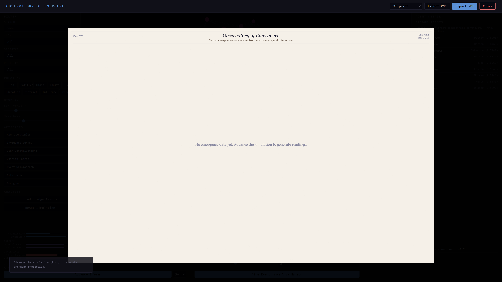

# CivGraph

An agent-based model of urban social dynamics, built on Pierre Bourdieu's theory of capital and habitus. 500 individuals in a mid-scale city form a living network where influence, opinion, and power flow through clan ties, professional bonds, and shared dispositions — shaped at every turn by the macro forces of economy, housing, migration, culture, and governance.


## Quick Start

```bash
pip install -r requirements.txt
python run.py
# http://localhost:8420
```

---

## Theoretical Foundations

CivGraph operationalizes concepts from Bourdieu's *Distinction* (1979) and *The Forms of Capital* (1986), combined with Granovetter's network embeddedness (1985) and Schelling-style emergent dynamics. The result is a simulation where macro-structural forces and micro-level dispositions produce stratification, coalition formation, and opinion cascades that mirror patterns observed in Western European cities.

### The four capitals

Bourdieu argued that social position is determined not by economic wealth alone, but by the interplay of multiple forms of capital. Each agent carries:

- **Economic capital** — wealth, income, property. Beta-distributed by social class with a Gini coefficient targeting ~0.32 (France/Germany average). A welfare-state floor of 0.15 prevents destitution — reflecting the social safety nets of the Rhineland model.
- **Cultural capital** — education, credentials, cultivated taste. Strongly path-dependent on education track (vocational: 0.20 base, elite/grande ecole: 0.78). This is the stickiest capital across generations — with an intergenerational elasticity of 0.50, it reproduces class position more reliably than wealth does.
- **Social capital** — network position, bridging ties, trust relationships. Derived from actual graph degree after city generation. Agents with high social capital lower the activation threshold for information propagation — they are the connectors.
- **Symbolic capital** — prestige, recognition, authority. Peaks in the established life phase (55-70). Partly inherited from clan reputation. Legitimized by democratic quality, devalued by corruption.

Influence is a derived composite: `0.4 × symbolic + 0.3 × social + 0.2 × economic + 0.1 × cultural`.

### Habitus

Bourdieu's concept of *habitus* — the durable, transposable dispositions acquired through socialization — is modeled as a set of internalized traits shaped by class origin and education:

- **Cultural taste** (-1 popular to +1 legitimate) — correlated r ≈ 0.6 with origin class. Determines who agents naturally gravitate toward.
- **Risk tolerance** — U-shaped by class: both upper classes (safety nets of wealth) and lower classes (nothing left to lose) show higher tolerance than the anxious middle.
- **Institutional trust** — peaks in the upper-middle class, where the system has most reliably worked in one's favor.
- **Class awareness** — stronger at class extremes, where the gap between one's position and the center is most felt.

Agents with similar habitus form bonds across clan boundaries (*habitus affinity ties*), reproducing Bourdieu's observation that class-based solidarity often cuts across ethnic and familial lines.

### Coloring the graph by social class

Switch to **Class** mode to see stratification. Brown/amber = lower and lower-middle, gray = middle, blue = upper-middle and upper. The clustering patterns reveal how class maps onto — but doesn't perfectly mirror — clan structure.


### Inspecting an individual

Click any node to see the full Bourdieusian profile: four capital bars (economic in green, cultural in purple, social in blue, symbolic in gold), habitus section (origin class, current class, education track, cultural taste), and personality traits. The connections list shows relationship types and trust weights.


---

## Events and Influence Propagation

Events ripple through the social graph via a BFS cascade with decay. Each agent's reaction depends on:

1. **Capital field relevance** — agents with capital matching the event's domain react more strongly (high economic capital → stronger reaction to housing crises)
2. **Political alignment** — Gaussian-weighted distance between agent's politics and the event's bias
3. **Habitus disposition** — institutional trust amplifies governance reactions, risk tolerance dampens crisis responses, cultural taste amplifies arts/education events
4. **Habitus affinity** — when the source agent shares dispositional similarity with the receiver, the trust channel is amplified
5. **Social capital threshold** — well-connected agents (high social capital) have a lower activation threshold, spreading information more readily
6. **Clan loyalty** — when an event targets an agent's own clan negatively, loyalty acts as a buffer


The event log tracks impact metrics. Each event also shifts macro-environment indicators — a housing crisis pushes up the price index and rent burden, erodes social cohesion, and reduces net migration.


### Bridge agents

Betweenness centrality identifies the agents who connect otherwise disconnected communities — the brokers, translators, and gatekeepers through whom information and influence must pass.


---

## Macro-Environment

18 time-varying indicators across 5 domains model the city's structural context. These evolve endogenously through economic feedback loops (Okun's law, Phillips curve, housing supply/demand) and are bidirectionally coupled with agent capital.

| Domain | Indicators | Key dynamics |
|---|---|---|
| **Economy** | GDP growth, unemployment, inflation, business confidence | Okun's law, Phillips curve, confidence feedback |
| **Housing** | Price index, vacancy rate, rent burden, construction | Supply/demand cycle, price-construction response |
| **Migration** | Net migration, diversity, integration | Attracted by jobs, repelled by rent burden |
| **Culture** | Cultural spending, social cohesion, media pluralism | Cohesion eroded by inequality, boosted by integration |
| **Governance** | Public spending, corruption, policy stability, democratic quality | Corruption mean-reverts; democratic quality tracks cohesion |

Advance the simulation by 1-10 years at a time. Each tick ages all agents, recomputes lifecycle phases, applies capital curves, and runs the full environment coupling. The **Capital** color mode shows how total capital volume shifts across the population over time.


### Environment → Agent coupling

- GDP growth raises economic capital proportional to existing wealth (the Matthew effect)
- Unemployment penalizes lower classes disproportionately (class-weighted)
- Inflation erodes unhedged savings (inverse wealth protection)
- Rent burden drains economic capital of those with less
- Cultural spending boosts cultural capital accumulation
- Democratic quality legitimizes symbolic capital; corruption devalues it

### Agent → Environment feedback

- Average economic capital drives business confidence
- Average symbolic capital supports democratic quality
- Opinion polarization (variance across agents) erodes social cohesion

---

## Emergent Properties

Thirteen macro-phenomena are computed from micro-level agent interactions — properties that cannot be predicted from any single agent's state. The emergence engine runs bidirectionally: emergent properties are measured *and* feed back into agent behavior (downward causation), while agents reshape the network topology through adaptive rewiring.


### The thirteen dimensions

| # | Dimension | Research basis | What it measures |
|---|-----------|---------------|-----------------|
| 1 | **Polarization** | Esteban & Ray 1994, Axelrod 1997 | Political/opinion clustering into distant factions (Esteban-Ray index) |
| 2 | **Inequality** | Piketty 2014, Merton 1968 | Gini, Palma ratio, Matthew effect (cumulative advantage correlation) |
| 3 | **Collective Intelligence** | Woolley et al. 2010, Page 2007 | Group capacity from cognitive diversity, connectivity, and social sensitivity |
| 4 | **Contagion Risk** | Watts 2002, Christakis & Fowler 2009 | Cascade vulnerability — activation thresholds, hub reach, open-subgraph density |
| 5 | **Network Resilience** | Barabasi 2002, Albert et al. 2000 | Random robustness vs. targeted hub fragility, articulation point fraction |
| 6 | **Phase Transitions** | Granovetter 1978, Centola 2018 | Proximity to critical tipping points (25% threshold, mobility tension) |
| 7 | **Echo Chambers** | Sunstein 2001, Pariser 2011 | Political/class homophily, opinion modularity, clan insularity |
| 8 | **Power Law** | Barabasi & Albert 1999, Clauset et al. 2009 | Zipf/Pareto fits for degree, wealth, and influence distributions |
| 9 | **Institutional Trust** | Putnam 2000, Fukuyama 1995 | Generalized trust, bridging vs. bonding capital, civic engagement |
| 10 | **Cultural Convergence** | Henrich 2015, Boyd & Richerson 1985 | Within-group homogenization, generational taste drift, interest convergence |
| 11 | **Information Integration** | Rosas et al. 2020, Tononi 2004 | Mutual information, transfer entropy, synergy, integrated information (phi) |
| 12 | **Norm Emergence** | Axelrod 1986, Bicchieri 2006 | Norm crystallization rate, compliance, fragmentation across communities |
| 13 | **Segregation** | Schelling 1971, Fossett 2006 | Dissimilarity index, isolation index, class-spatial sorting, satisfaction |

### Inter-dimension coupling

Emergent properties don't exist in isolation — they form reinforcing and dampening feedback loops. A 13×13 coupling matrix drives these interactions:

- Polarization **amplifies** echo chambers (+0.15) and **erodes** institutional trust (-0.10)
- Inequality **fuels** phase transitions (+0.12) and **drives** segregation (+0.10)
- Echo chambers **reduce** collective intelligence (-0.10) and **reinforce** polarization (+0.12)
- Institutional trust **strengthens** resilience (+0.10) and **dampens** contagion risk (-0.08)
- Norm emergence **builds** trust (+0.08) and **promotes** cultural convergence (+0.06)

Raw dimension scores are computed independently, then coupling effects are applied as a post-processing layer, producing *coupled composites* that reflect the full system dynamics.

### Downward causation

Emergence is not epiphenomenal in CivGraph — macro-level patterns actively constrain and enable agents:

- **Polarization > 0.3** reduces cross-group openness and increases assertiveness (entrenched positions)
- **Inequality > 0.4** raises class awareness and reduces risk tolerance for lower classes
- **Echo chambers > 0.3** further reduces openness (information filtering)
- **Low institutional trust < 0.4** erodes individual trust; high trust lifts it
- **High contagion > 0.5** raises openness (susceptibility)
- **Segregation > 0.3** reduces satisfaction for minority-position agents

### Adaptive network rewiring (Gross & Blasius 2008)

The network topology is not frozen. Each tick, 5% of agents consider rewiring:

1. **Opinion-driven dissolution** — drop ties to strong disagreers (political distance + opinion conflict)
2. **Homophily-driven formation** — form ties to politically/culturally similar unconnected agents
3. **Triadic closure** — friends-of-friends become friends (weighted by existing tie strength)
4. **Weak tie decay** — very low weight edges (< 0.1) dissolve stochastically

### Norm emergence (Axelrod 1986, Bicchieri 2006)

Social norms crystallize from repeated interaction without top-down coordination:

- Norms seed from political leanings and interest domains
- **Local averaging**: agents adopt the weighted average opinion of neighbors as a local norm
- **Compliance pressure**: agents drift toward local norms, modulated by loyalty
- **Sanctions**: deviance from strong norms costs social capital
- Norms fragment when different communities develop conflicting expectations

### Schelling segregation (1971)

The canonical emergence example — mild individual preferences produce macro-level spatial sorting:

- Each agent's **satisfaction** reflects the fraction of district neighbors sharing their clan or class
- Dissatisfied agents (< 35% threshold) attempt to move to a more satisfactory district
- Tracked via dissimilarity index, isolation index, and class-spatial dissimilarity

### Critical slowing down (Scheffer et al. 2009)

Early warning signals detect approaching regime shifts:

- **Rising autocorrelation** (lag-1 AC trend) — the system is losing memory faster, taking longer to recover from perturbations
- **Rising variance** — fluctuations growing before a tipping point
- **Flickering** — rapid oscillations indicating bistability
- Warning levels: safe → watch → warning → **CRITICAL**

These are displayed as pulsing warning dots in the environment panel and as badges on the emergence artifact panels.

### Per-agent emergence attribution

Every agent receives two scores:
- **Catalyst** — how much this agent contributes to emergent dynamics (bridging ties, opinion extremity, norm influence, connectivity)
- **Constrained** — how much macro patterns shape this agent (norm compliance, satisfaction constraint, homophily pressure)

These scores drive the **Emergence** color mode (magma colorscale by catalyst score) and appear in the agent detail panel.


### Observatory of Emergence (Plate VII)



The emergence artifact renders all 13 dimensions as:
- **Central radar chart** with concentric 0-100% rings. Historical snapshots overlay as faded polygons.
- **Side panels** (7 left, 6 right) showing sub-metrics, research citations, trend arrows, early warning badges, and coupling delta (how much feedback shifted the raw score).
- **Coupling web** — a small circular network showing reinforcing (green) and dampening (red) feedback loops between dimensions.
- **Temporal sparklines** tracking the evolution of each dimension over simulation years.

---

## Lifecycle and Intergenerational Transmission

Five phases with capital multipliers reflecting empirical Western European life-course patterns:

| Phase | Ages | Economic | Cultural | Social | Symbolic |
|---|---|---|---|---|---|
| Education | 18-24 | 0.15 | 0.55 | 0.30 | 0.05 |
| Early career | 25-34 | 0.50 | 0.75 | 0.50 | 0.15 |
| Mid career | 35-54 | 1.00 | 0.90 | 0.80 | 0.50 |
| Established | 55-69 | 0.85 | 1.00 | 1.00 | 1.00 |
| Elder | 70+ | 0.70 | 0.95 | 0.75 | 0.90 |

Within clans, agents aged 45+ are assigned as parents of agents under 30. Capital transmits with friction:

- **Economic**: transfer rate 0.65 (after inheritance tax, FR/DE/NL average), intergenerational elasticity 0.35
- **Cultural**: elasticity 0.50 — Bourdieu's central finding that cultural capital reproduces class position more reliably than wealth
- **Symbolic**: 30% from parent, 20% from clan average (the family name effect)
- **Habitus**: child inherits parent's cultural taste (weight 0.6), institutional trust (0.5), risk tolerance (0.4) — dispositions are durable but not deterministic
- **Education track**: class-correlated probability tables calibrated to FR/DE patterns (upper: 35% elite + 45% academic; lower: 60% vocational + 9% academic)

### Class structure

20 clans are assigned class centers (Delacroix = 3.8/upper, Kowalski = 1.1/lower). Individual members deviate with noise, creating realistic within-clan variation while preserving the correlation between family origin and class position that Bourdieu documented.

---

## Exportable Artifacts

Seven print-quality visualizations rendered to canvas in a scientific engraving aesthetic — ivory paper, fine ink lines, crosshatching, serif typography. All exportable as PNG or PDF, including dedicated **A2 300dpi** presets (landscape: 7016×4961px, portrait: 4961×7016px) for archival-quality prints.

### Anatomies of Agency (Plate I)

Each of the city's 80 most influential agents rendered as a unique radial glyph. Four colored quadrant arcs encode capital (green = economic, purple = cultural, blue = social, ochre = symbolic). Radiating spokes mark interest domains. The core dot sizes by agency (influence × assertiveness). Political lean rotates the glyph. Stipple density encodes network degree. Ink color = clan.


### Survey of Influence (Plate II)

Gaussian kernel density estimation over force-layout positions. Influence radiates as terrain elevation, rendered with crosshatched bands and ink contour lines at 15% intervals. Red survey markers for agents, labeled for top influencers.


### Constellations of Clan (Plate III)

Star chart. Each clan is a constellation connected by minimum-spanning-tree lines. Horizontal axis = political leaning (far left to far right). Vertical axis = influence. Star brightness scales with influence; high-influence agents get cross-flares.


### Pulse of the City (Plate VI)

Layered time-series strips showing all 18 environment indicators evolving over simulation years. Five domain rows (economy, housing, migration, culture, governance), each with overlapping ink traces.


### Additional artifacts

- **Fabric of Opinion** (Plate IV) — woven-textile grid (rows = clans, columns = topics). Vertical green hatching = support, horizontal red = opposition, cross-hatch sepia = internal disagreement. Requires fired events.
- **Seismograph of Events** (Plate V) — strip-chart waveforms showing cascade amplitude per propagation step. Oscillation frequency increases with depth.
- **Observatory of Emergence** (Plate VII) — 13-dimension radar chart with coupling web, early warning badges, temporal sparklines, and per-dimension research citations. See the Emergent Properties section above.

---

## Architecture

```
emergence.py   — 13-dimension emergent properties engine: polarization,
                 inequality, collective intelligence, contagion, resilience,
                 phase transitions, echo chambers, power law, trust,
                 cultural convergence, information-theoretic, norms,
                 segregation. Plus: downward causation, adaptive rewiring,
                 norm dynamics, Schelling segregation, inter-dimension
                 coupling, critical slowing down, per-agent attribution.
environment.py — 18-indicator macro model, internal dynamics (Okun, Phillips,
                 supply/demand), bidirectional agent coupling, event coupling
capital.py     — Bourdieu's four capitals, habitus, lifecycle curves,
                 intergenerational transmission, Western European calibration
model.py       — Agent dataclass (with norms, satisfaction, emergence score),
                 city generator (500 agents, 7 edge types, class-stratified
                 clans), graph queries, D3 export
events.py      — Event system, capital-aware BFS propagation, habitus
                 disposition filtering, coalition detection
server.py      — FastAPI REST + WebSocket API, Pydantic validation,
                 security-hardened (XSS, CSRF, origin checking)
static/        — D3.js frontend (9 color modes, 7 artifacts, emergence
                 gauges with early warnings, A2 print export)
run.py         — Launcher (localhost-only)
```

## API

| Endpoint | Description |
|---|---|
| `GET /api/graph` | Full graph (nodes with capital/habitus, edges with types) |
| `GET /api/stats` | Network statistics + class distribution + capital averages |
| `GET /api/agent/{id}` | Agent detail (capital, habitus, neighbors) |
| `GET /api/search` | Search by name, clan, district, politics |
| `GET /api/meta` | Metadata (clans, districts, classes, education tracks) |
| `POST /api/event` | Trigger event with capital-aware propagation |
| `GET /api/opinion/{topic}` | Opinion breakdown by clan/district/politics |
| `GET /api/bridges` | Top 20 bridge agents by betweenness centrality |
| `GET /api/coalitions/{topic}` | Emergent coalitions around a topic |
| `GET /api/influence_path/{a}/{b}` | Shortest influence path between agents |
| `GET /api/environment` | Current macro-environment indicators |
| `GET /api/environment/history` | Full indicator history (for City Pulse artifact) |
| `GET /api/environment/meta` | Indicator metadata (labels, ranges, domains) |
| `POST /api/tick` | Advance simulation 1-10 years (with emergence dynamics) |
| `POST /api/reset?seed=N` | Reset city + environment + emergence with new seed |
| `GET /api/emergence` | Full emergence state (composites, coupled, warnings, history) |
| `GET /api/emergence/snapshot` | Fresh computation (not recorded to history) |
| `GET /api/emergence/history` | Emergence composite history for sparklines |
| `GET /api/emergence/meta` | Dimension metadata (labels, research, descriptions) |
| `GET /api/emergence/coupling` | Inter-dimension coupling matrix |
| `GET /api/emergence/agent/{id}` | Per-agent emergence attribution (catalyst/constrained) |
| `WS /ws` | WebSocket for live propagation animation |
